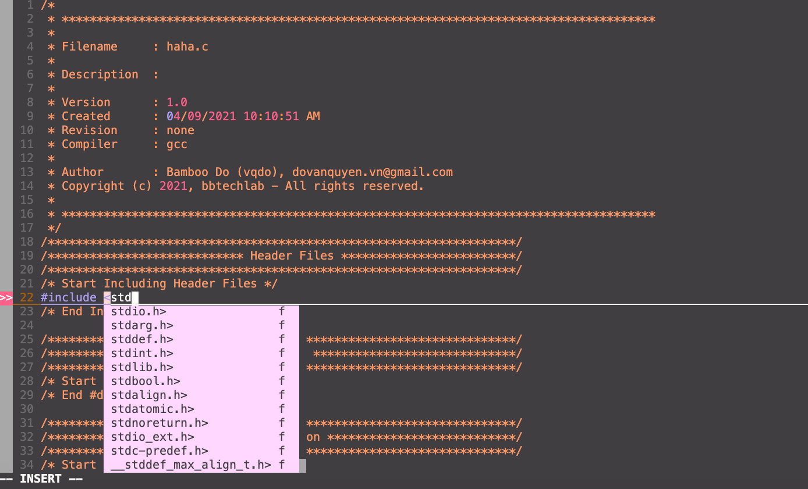

# Objectives
Using VIM as programming IDE (such as Sublime, Visual Studio Code, ...)
As we know well, we always leave lots of typo errors of coding, such as forgetting to add headers and didn't quote namespaces, etc.. And we added many parameters or change functions name, so we need to shifts rest of codes in same line to make it align.

To fix those issues, I chose [YouCompleteMe](https://github.com/ycm-core/YouCompleteMe/blob/master/README.md) to make VIM a little bit smart.

# Prerequisite 
## Host Machine - Ubuntu 16.04.LTS
```
bamboo@bbtechlab:~/workspace/study$ uname -a
Linux bbtechlab 4.15.0-136-generic #140~16.04.1-Ubuntu SMP Wed Feb 3 18:51:03 UTC 2021 x86_64 x86_64 x86_64 GNU/Linux
```
* sudo apt-get install vim cmake

## Install Pathogen
```
$ mkdir -p ~/.vim/autoload ~/.vim/bundle && \
$ curl -LSso ~/.vim/autoload/pathogen.vim https://tpo.pe/pathogen.vim
```
## Install python3.6 && gcc-8
```
$ sudo add-apt-repository ppa:ubuntu-toolchain-r/test -y && \
sudo add-apt-repository ppa:deadsnakes/ppa && sudo apt-get update -y \
sudo apt-get install build-essential software-properties-common -y && \
sudo apt-get install gcc-9 g++-9 -y && \
sudo update-alternatives --install /usr/bin/gcc gcc /usr/bin/gcc-9 60 --slave /usr/bin/g++ g++ /usr/bin/g++-9 && \
sudo update-alternatives --config gcc \
sudo apt-get install python3.6-dev
$ python3.6 --version
Python 3.6.13
$ gcc --version
gcc (Ubuntu 9.3.0-23ubuntu1~16.04) 9.3.0
Copyright (C) 2019 Free Software Foundation, Inc.
This is free software; see the source for copying conditions.  There is NO
warranty; not even for MERCHANTABILITY or FITNESS FOR A PARTICULAR PURPOSE. 
```
## Upgrade Vim 8.2 or higher
```
$ sudo apt-get remove --purge vim vim-runtime vim-gnome vim-tiny vim-common vim-gui-common
$ sudo rm -rf /usr/local/share/vim && sudo rm -rf /usr/bin/vim
$ git clone https://github.com/vim/vim.git
$ cd vim/src 
$ export PREFIX='/usr/local'
$ ./configure --with-features=huge \
--enable-multibyte \
--enable-rubyinterp=yes \
--enable-python3interp=yes \
--with-python3-config-dir=/usr/lib/python3.6/config-3.6m-x86_64-linux-gnu \
--enable-perlinterp=yes \
--enable-luainterp=yes \
--enable-gui=auto \
--enable-gtk2-check \
--with-python3-command=python3.6 \
--enable-cscope \
-prefix=$PREFIX
$ make
$ sudo make install
```
```
$ vim --version
VIM - Vi IMproved 8.2 (2019 Dec 12, compiled Apr  9 2021 09:17:24)
Included patches: 1-2739
Compiled by bamboo@bbtechlab
Huge version without GUI.  Features included (+) or not (-):
+acl               -farsi             +mouse_sgr         +tag_binary
+arabic            +file_in_path      -mouse_sysmouse    -tag_old_static
+autocmd           +find_in_path      +mouse_urxvt       -tag_any_white
+autochdir         +float             +mouse_xterm       -tcl
-autoservername    +folding           +multi_byte        +termguicolors
-balloon_eval      -footer            +multi_lang        +terminal
+balloon_eval_term +fork()            -mzscheme          +terminfo
-browse            +gettext           +netbeans_intg     +termresponse
++builtin_terms    -hangul_input      +num64             +textobjects
+byte_offset       +iconv             +packages          +textprop
+channel           +insert_expand     +path_extra        +timers
+cindent           +ipv6              -perl              +title
-clientserver      +job               +persistent_undo   -toolbar
-clipboard         +jumplist          +popupwin          +user_commands
+cmdline_compl     +keymap            +postscript        +vartabs
+cmdline_hist      +lambda            +printer           +vertsplit
+cmdline_info      +langmap           +profile           +virtualedit
+comments          +libcall           -python            +visual
+conceal           +linebreak         +python3           +visualextra
+cryptv            +lispindent        +quickfix          +viminfo
+cscope            +listcmds          +reltime           +vreplace
+cursorbind        +localmap          +rightleft         +wildignore
+cursorshape       -lua               -ruby              +wildmenu
+dialog_con        +menu              +scrollbind        +windows
+diff              +mksession         +signs             +writebackup
+digraphs          +modify_fname      +smartindent       -X11
-dnd               +mouse             -sound             -xfontset
-ebcdic            -mouseshape        +spell             -xim
+emacs_tags        +mouse_dec         +startuptime       -xpm
+eval              -mouse_gpm         +statusline        -xsmp
+ex_extra          -mouse_jsbterm     -sun_workshop      -xterm_clipboard
+extra_search      +mouse_netterm     +syntax            -xterm_save
   system vimrc file: "$VIM/vimrc"
     user vimrc file: "$HOME/.vimrc"
 2nd user vimrc file: "~/.vim/vimrc"
      user exrc file: "$HOME/.exrc"
       defaults file: "$VIMRUNTIME/defaults.vim"
  fall-back for $VIM: "/usr/local/share/vim"
Compilation: gcc -c -I. -Iproto -DHAVE_CONFIG_H -g -O2 -U_FORTIFY_SOURCE -D_FORTIFY_SOURCE=1 
Linking: gcc -L/usr/local/lib -Wl,--as-needed -o vim -lm -ltinfo -ldl -L/usr/lib/python3.6/config-3.6m-x86_64-linux-gnu -lpython3.6m -lpthread -ldl -lutil -lm 
```
## Upgrade CMake 3.18 or higher
```
$ sudo apt-get install libssl-dev
$ wget https://cmake.org/files/v3.18/cmake-3.18.0.tar.gz
$ tar -xfz cmake-3.18.0.tar.gz && cd cmake-3.18.0
$ ./bootstrap
$ make
$ sudo make install
$ cd 
$ source .bashrc
```
# Download & Install YouCompleteMe for VIM
## Download & Install YouCompleteMe
```
$ mkdir -p ~/workspace/.vim/bundle
$ cd  ~/workspace/.vim/bundle
$ git clone https://github.com/Valloric/YouCompleteMe.git
$ cd YouCompleteMe && git submodule update --init --recursive
$ python3.6 install.py --clangd-completer
```
## Prepare .ycm_extra_conf.py 
$ cd ~/workspace/.vim
$ wget  https://raw.githubusercontent.com/rasendubi/dotfiles/master/.vim/.ycm_extra_conf.py

## Add following lines to your .vimrc
```
" YouCompleteMe
execute pathogen#infect('~/workspace/.vim/bundle/{}')
filetype plugin indent on
syntax on
let g:ycm_global_ycm_extra_conf = "~/workspace/.vim/.ycm_extra_conf.py"
:set backspace=indent,eol,start
" ~YouCompleteMe
```
# Show the result


# References,
* https://gist.github.com/j-jith/f25fbcb826dff37a28bd190b584afd04
* https://xuechendi.github.io/2019/11/11/VIM-CPP-IDE-2019-111-11-VIM_CPP_IDE


